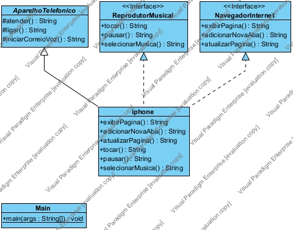

# Modelagem UML e de Classe de um iphone
A diagramação das classes e interfaces com a proposta de representar os papéis do iPhone de: Reprodutor Musical, Aparelho Telefônico e Navegador na Internet. Diagrama de classe feito pelo Visual Paradigm.

